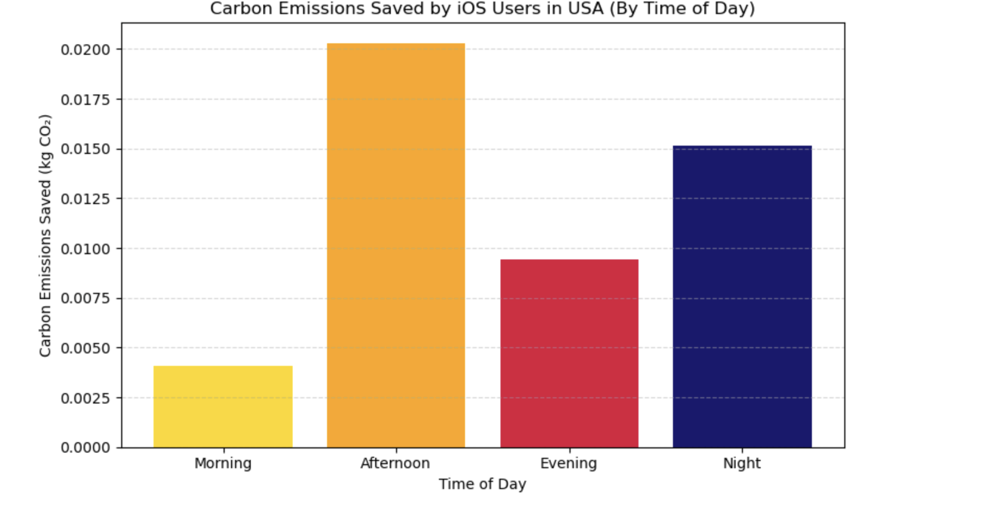
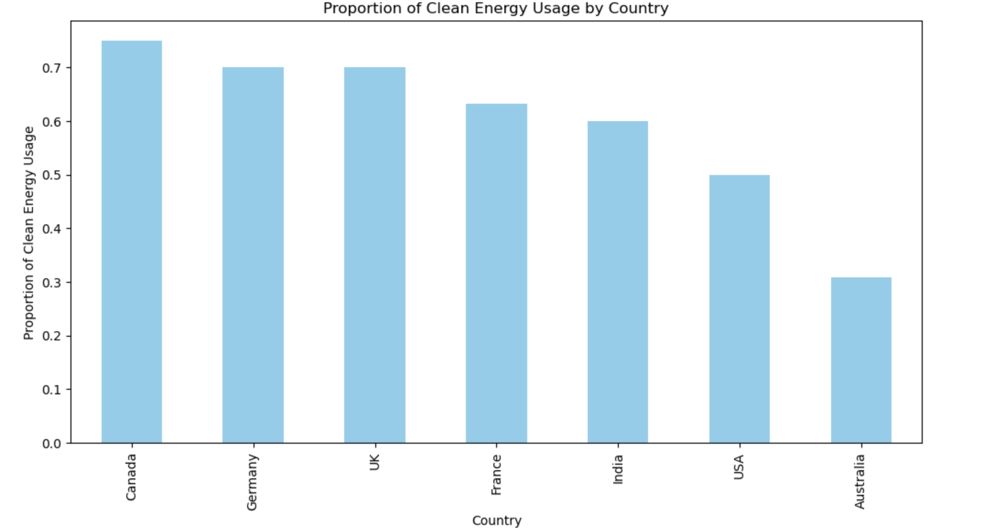

# Carbon Emission Prediction Model

## 📌 Project Overview
This project analyses and predicts carbon emissions based on user activity, device usage, and energy consumption patterns. The aim is to understand how digital behaviour contributes to environmental impact.

## 🎯 Objectives
- Analyse user activity data
- Identify factors affecting carbon emissions
- Build a predictive machine learning model
- Compare energy usage patterns (iOS vs Android)

## 🛠 Tools & Technologies
- Python (Pandas, NumPy)
- Scikit-learn
- Matplotlib / Seaborn
- Jupyter Notebook

## 🔍 Methodology
- Data cleaning and preprocessing
- Feature engineering
- Exploratory Data Analysis (EDA)
- Model building (Regression)
- Model evaluation

## 📊 Results & Insights
- Higher usage time leads to increased carbon emissions
- Clean energy usage significantly reduces emissions
- Device type influences energy consumption patterns

## 📁 Files
- `dissertation original.ipynb` – Full analysis and model

- ## 📷 Visualisations

### Carbon Emissions by Time of Day (iOS Users - USA)

### Clean Energy Usage by Country

### iOS vs Android Usage (USA)

